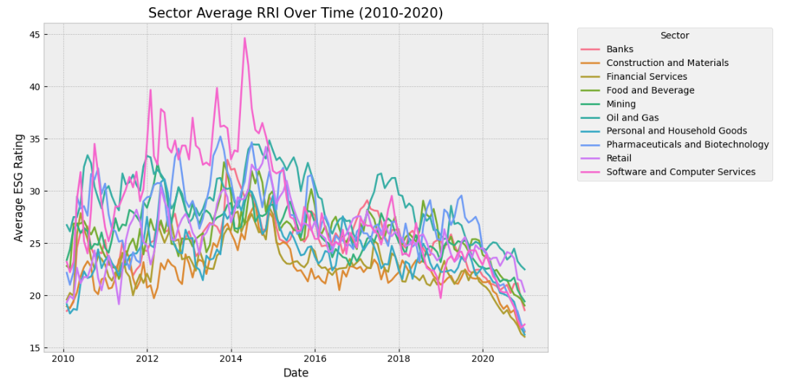
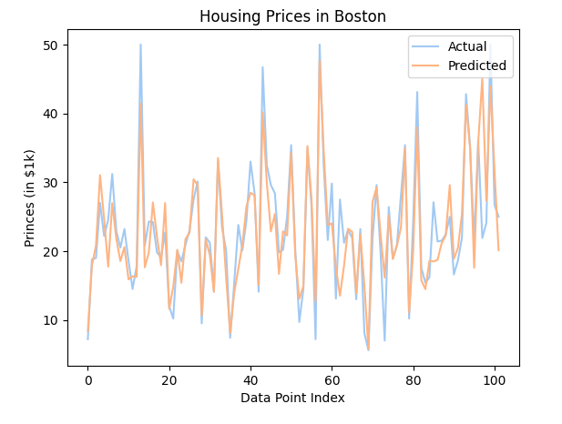
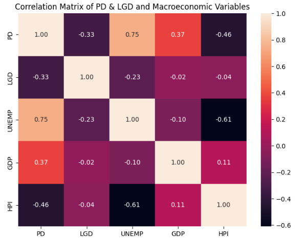
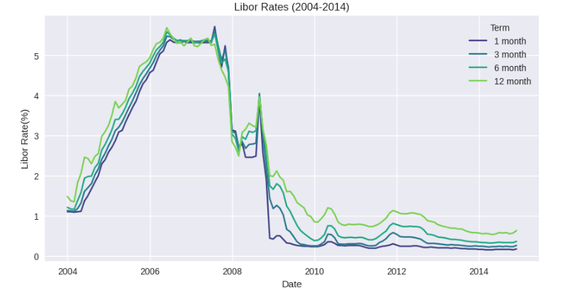

## Chenny Liu

**Data Analyst**

**Technical skills:  Python, R, SQL, SAS, NumPy, Sikit-learn, Pandas**

This is the page where I share my past analytical experience including snippets of the results and more detail on the methodologies🤝.

### Education
- <b> M.Sc.,Financial Modelling &nbsp; &nbsp; &nbsp; &nbsp; &nbsp; Western University (_Aug 2024_) </b>

- <b> B.Sc.,Mathematics & Statistics &nbsp; &nbsp; McMaster University (_June 2023_) </b>

### Industry Experience 
**Teaching Assistant @ Western University (_Jan-Aug 2024_)**
- Held 6 hours of help sessions for a second-year statistics class, assisting students from non-technical
 backgrounds, such as humanities and social sciences, with R coding tasks like generating scatterplots to
 analyze variable relationships, resulting in over 75% of assignment submissions achieving perfect scores
 for their graphs

- Successfully handled 250 students’ exam questions on statistical concepts within 48 hours by thoroughly
 reviewing the marking scheme, focusing on common misconceptions such as standard deviation vs.
 margin of error, and provided individual feedback to over 15% of submissions while completing the task
 ahead of the deadline

**Financial Analyst @ China Construction Bank (_July-Aug 2021_)**
-  Aggregated and organized financial data for monthly variance analysis reports by meticulously reviewing
 bank statements from the past month, ensuring over 90% of data readiness

### Analytical Work Demo

**ESG Rating Analysis Across Global Sectors** &nbsp; 

The full analysis can be viewed in Jupyter notebook [here](/notebooks/ESG_risk_analytics.ipynb).

<figure align="center">
  
  <figcaption><em>Figure 1: ESG rating changes over time in different industries.</em></figcaption>
</figure> \

- Cleaned and processed 2,511,168 rows of RepRisk ESG ratings data from 2010 to 2020, covering 17,002
 companies in 206 industries around the world
- Visualized time-series analysis on 10 key sectors across Canada, China, the United States, and Germany
 to reveal country-specific trends for sustainable investments
- Portrayed time-trend distributions by extracting β values from linear regression of 150+ companies per
 sector
- Quantified correlation positivity by 90% in ESG scores among companies in 10 key sectors using Spear
man’s measure, distance correlation, and Maximal Information Coefficient
- Developed and delivered comprehensive reports highlighting key findings and trends in ESG data to
 academic stakeholders

### Machine Learning Modelling Deployment

**Lending Club Credit Risk Analytics**

Full analysis available [here](https://github.com/lc587/projects-summary/blob/main/notebooks/Credit_risk_analytics.ipynb).

-  Estimated loan default probability using a logistic regression model on a cleaned dataset of 1.3 million
 loans, achieving 87.7% accuracy through Weight of Evidence transformation and variable selection

**Boston Housing Price Prediction**

 View the full Jupyter notebook [here](https://github.com/lc587/projects-summary/blob/main/notebooks/Boston_housing_price_analytics.ipynb).

- Predicted Boston's housing price using Neural Networks model (Keras).

**Loan Performance Stress Testing**
- Achieved 70% accuracy in forecasting probability of default (PD) and loss given default (LGD) rates
 by applying k-fold cross-validation on a logistic regression model, enhanced with key macroeconomic
 indicators such as unemployment rate, real GDP, and house price index   

**Gherkin Tower Risk Analysis**
- Quantified potential losses of £600 million over a 10-year period by calculating Expected Shortfall and
 Value-at-Risk using LIBOR and exchange rate data

